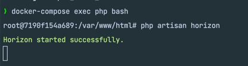
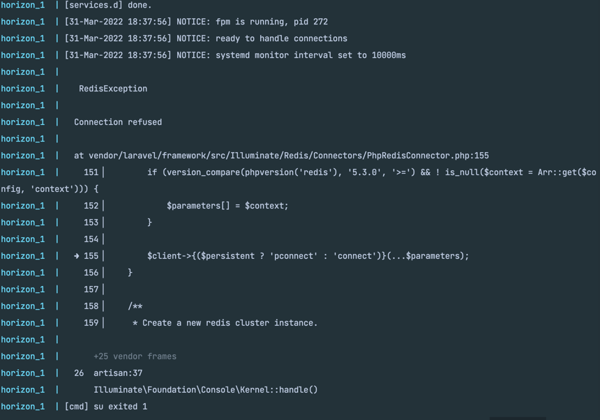

# Demo for Horizon Issue

1. create a laravel project
```bash
# This is taken from https://serversideup.net/open-source/spin/examples/laravel
docker run --rm -e "S6_LOGGING=1" -v $(pwd):/var/www/html serversideup/php:8.1-fpm composer create-project laravel/laravel example-app
```
2. install horizon
````bash
# cd into example app folder
cd example-app
# require horizon
composer require laravel/horizon
# install horizon
php artisan horizon:install
````
3. Spin 😉 the containers up
````bash
docker-compose up -d --build
````

## Now the issue

The issue really is: if you bash into the container everything works as expected. 
But if you run horizon as command as you suggest in your tweet/doc etc horizon will fail.

1. Prove that horizon works within the container
```bash
docker-compose exec php bash
# Run horizon
php artisan horizon
```
you should see the following

Q.E.D

2. Prove that the container failed

If you look into logs you are going to see that the horizon container shut down with a failure
```bash
docker-compose logs horizon
```
Among the lines you should see the connection error
